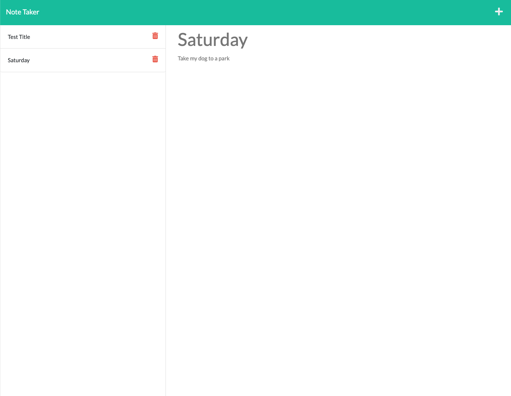

# Note Taker

* Link to the deployed app: https://aqueous-dusk-57011.herokuapp.com/
  
## Home page

* The User is presented with home page when they open the Note Taker.
* When User clicks on the link to the notes page they are presented with a page with existing notes listed in the left-hand column, plus empty fields to enter a new note title and the note’s text in the right-hand column.

--------

## Notes : 

### Enter new note
* When the User enters a new note title and the note’s text
a Save icon appears in the navigation at the top of the page.

### View New note

* When the User clicks on a save icon, the new note the User has entered is saved and appears in the left-hand column with the other existing notes.
* When the User clicks on an existing note in the list in the left-hand column that note appears in the right-hand column.

* When the User clicks on the Write icon in the navigation at the top of the page they are presented with empty fields to enter a new note title and the note’s text in the right-hand column.

### Delete note (BONUS)

* When the User clicks on delete icon, corresponding note gets deleted. 

